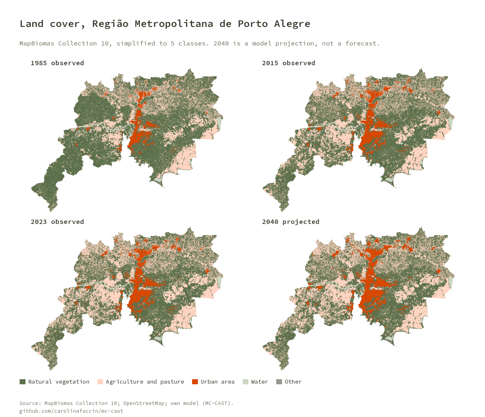
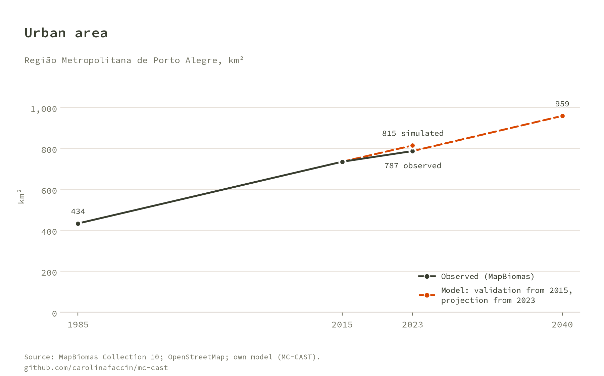
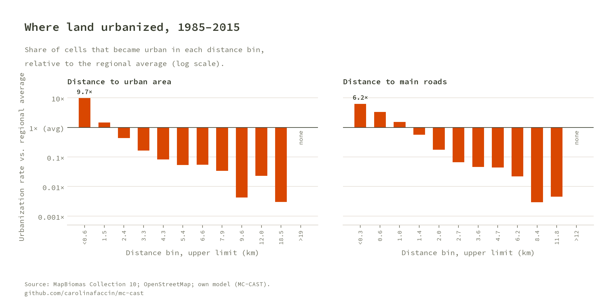
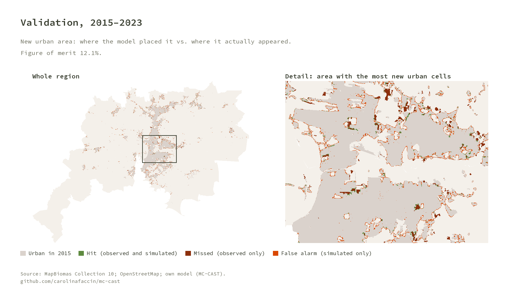

# MC-CAST

**MC-CAST** - _Markov Chains and Cellular Automata Simulation Tool_ - simulates urban expansion from land-cover data from [MapBiomas](https://mapbiomas.org). The study area is the **Porto Alegre Metropolitan Region (RMPA)**, Brazil: the full territory of its 34 municipalities (IBGE codes in [`config.yaml`](config.yaml)), not just the urbanized areas. The model is trained on 1985–2015, validated against the observed 2023 map, and projected to 2040.

> **Study project.** This is a personal, exploratory project to practice land-use change modeling and to build a portfolio. It is a deliberately simple model, not a planning instrument, and its projections should not be used for decisions.



## Results

Everything below was produced by `mccast all` with the default configuration; the files are in [`outputs/`](outputs/).

### Urban area

| Year | Urban area (km²) | Share of the region | Source |
| --- | ---: | ---: | --- |
| 1985 | 434 | 4.2% | MapBiomas |
| 2015 | 735 | 7.1% | MapBiomas |
| 2023 | 787 | 7.6% | MapBiomas |
| 2040 | 959 | 9.3% | Projection (+22% over 2023) |



The region covers about 10,300 km². Full class-by-class areas are in [`outputs/area_by_class.csv`](outputs/area_by_class.csv).

### What the model learned

For each factor, the share of cells that urbanized in 1985–2015 is compared with the regional average. Cells within about 600 m of existing urban area were roughly 10 times more likely to urbanize than average, and cells within about 300 m of a main road about 6 times. Beyond about 3 km from either, cells were more than 5 times less likely than average to urbanize.



### Validation: 2015 → 2023

The model was run from the 2015 map and compared with the observed 2023 map.



| Metric | Value |
| --- | ---: |
| New urban area observed | 53 km² |
| New urban area simulated | 80 km² |
| Correctly placed (hits) | 14 km² |
| Figure of merit | 12.1% |
| Producer's accuracy (share of real growth found) | 27.0% |
| User's accuracy (share of simulated growth that was real) | 18.0% |
| Kappa (urban vs. non-urban) | 0.93 |

How to read this:

- The figure of merit is hits divided by hits + misses + false alarms. A "no change" model scores 0, so 12% is skill beyond persistence, though modest.
- The model **overestimates the amount** of growth by about 50%. The Markov matrix carries the 1985–2015 pace (about 10 km² per year), while 2015–2023 was slower (about 6.5 km² per year). The 2040 projection inherits that pace, so read it as a plausible upper range, not a forecast.
- Hits concentrate on the edges of existing urban areas, which is where the model is built to look. It misses new, isolated patches (subdivisions, industrial sites away from the urban edge).
- Kappa is high mostly because most of the territory did not change. It says little about the quality of the projection.

## How it works

1. **Data.** MapBiomas annual land cover (Collection 10, 30 m) is read as a window of the national GeoTIFF, masked to the 34 municipalities, and reclassified into 5 classes: natural vegetation, agriculture and pasture, urban, water, other (legend in `config.yaml`).
2. **Markov chain (how much).** A transition matrix is estimated between 1985 and 2015 and rescaled with a fractional matrix power to the length of the target period. It gives the amount of new urban area expected.
3. **Suitability (where, part 1).** A minimal, data-driven score. For two factors, distance to existing urban area and distance to main roads (OpenStreetMap), the share of candidate cells that urbanized in 1985–2015 is measured per quantile bin. A cell's score is the base rate times the product of each bin's lift over the base rate. No weights are chosen by hand. Distance to urban area is recomputed every simulated year.
4. **Cellular automaton (where, part 2).** Each year the demand is allocated to the cells with the highest potential: suitability × share of urban cells in the 5×5 neighborhood × a small random factor. Water is excluded, and only cells touching urban area are candidates.
5. **Validation.** Run from 2015 and compare with the observed 2023 map.
6. **Projection.** Run from 2023 to 2040.

Details are in [`docs/documentation.md`](docs/documentation.md).

## Known limitations

- Only **urban expansion** is allocated in space. Other classes change only where urban replaces them; the Markov matrix is used for urban demand only.
- Roads are the **current** OpenStreetMap network applied to 1985–2015, so proximity to roads partly captures growth that created the roads.
- The two suitability factors are assumed independent.
- No protected areas, slope or flood-risk restrictions.
- A single run with one random seed; no uncertainty estimate.
- MapBiomas classification noise (cells flickering between classes) can create spurious transitions.
- Distances use a fixed 30 m cell size, but the grid is in degrees, so cells are about 26 × 30 m at this latitude.

## What still needs to be done

**Model**
- [ ] Fix the quantity bias: calibrate demand on a more recent period or use low / central / high growth scenarios instead of a single projection.
- [ ] Allocate the other classes (agriculture, natural vegetation) with the Markov matrix, not just urban.
- [ ] Add restrictions and factors: protected areas and conservation units, slope (DEM), flood-prone areas (relevant after the May 2024 floods), distance to the metropolitan core and to local centers.
- [ ] Use a historical road network or a time-invariant proxy instead of today's roads.
- [ ] Apply a temporal filter to the MapBiomas series to reduce class flicker.
- [ ] Work in a projected CRS (e.g. SIRGAS 2000 / Brazil Polyconic) so distances and areas are exact.

**Validation**
- [ ] Compare against simple baselines (suitability only, random cells on the urban edge) to show what the cellular automaton adds.
- [ ] Split disagreement into quantity and allocation (Pontius), and add a spatial-tolerance score.
- [ ] Run multiple seeds and report the spread; sensitivity analysis for neighborhood radius, noise and number of bins.
- [ ] Validate on a different split (e.g. train 1985–2008, test 2008–2023).

**Analysis and delivery**
- [ ] Results per municipality and per corridor, and what land cover growth replaces.
- [ ] Short write-up of findings once the model is improved.
- [ ] Continuous integration for tests and a pinned environment (lock file).

## Usage

Python 3.10+.

```bash
pip install -e ".[dev]"
pytest                      # unit tests on synthetic grids, no downloads

mccast download             # clip 1985, 2015 and 2023 (add --all-years for a time series)
mccast train                # Markov matrix + suitability, 1985-2015
mccast validate             # simulate 2015-2023, compare with observed -> outputs/metrics.json
mccast project              # 2023-2040
mccast export               # figures and tables -> outputs/
# or everything at once:
mccast all
```

The first `train` downloads main roads from the public Overpass API in tiles, which can be slow when the server is busy (it retries automatically). Everything region- and data-specific is in [`config.yaml`](config.yaml): municipality list, years, class legend, CA parameters. Raw and processed rasters go to `data/` and are git-ignored; they are regenerated by `mccast download`.

## Repository structure

```
mc-cast/
├── config.yaml        # study area, years, legend, parameters
├── src/mccast/
│   ├── data.py        # download, clip, reclassify, roads
│   ├── markov.py      # transition matrix and projection
│   ├── suitability.py # empirical suitability
│   ├── ca.py          # cellular automaton allocation
│   ├── validate.py    # figure of merit, kappa
│   ├── pipeline.py    # train / validate / project
│   ├── export.py      # maps, plots and tables
│   ├── style.py       # figure style: source line and repository name
│   ├── brand.py       # visual identity (colors, Source Code Pro, layout); copied from
│   │                  # the author's brand repository, do not edit here
│   └── cli.py
├── tests/             # synthetic-grid tests
├── assets/fonts/      # Source Code Pro (SIL OFL)
├── docs/              # method notes
├── data/              # raw/ and processed/ rasters (git-ignored)
└── outputs/           # metrics, tables, figures (rasters git-ignored)
```

## Data

- [MapBiomas](https://mapbiomas.org) land use and land cover, Collection 10 (CC BY 4.0).
- Municipal boundaries via [geobr](https://github.com/ipeaGIT/geobr) (IBGE). Municipality list from the IBGE localities API (metropolitan region 07401).
- Roads: © OpenStreetMap contributors (ODbL).
- Figures use the Source Code Pro typeface (SIL Open Font License).

## License

See [LICENSE](LICENSE).
